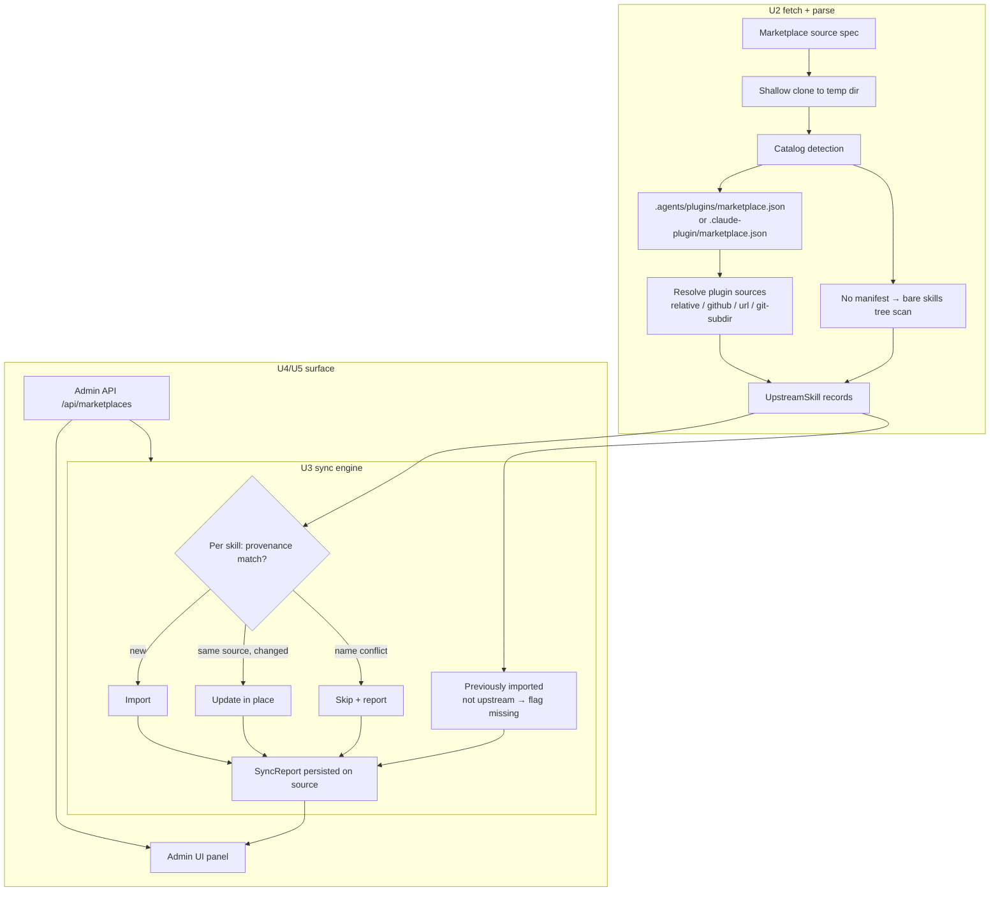
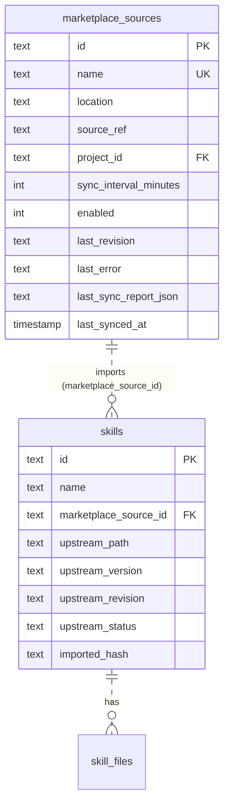

# feat: Add Claude Code / Codex marketplace sources with sync and update

## Goal Capsule

- **Objective:** SkillHub admins can register external Claude Code or Codex marketplace repositories as skill sources and keep their imported skills current with upstream — add a source once, sync to import, re-sync to pick up upstream changes.
- **Means:** A marketplace source registry plus a fetch → parse → sync pipeline that imports upstream skills as first-class SkillHub skills carrying upstream provenance (KTD1, KTD2, KTD3, KTD4).
- **Authority hierarchy:** The user's request and the confirmed scope answer (marketplaces are import sources, not export targets) constrain product behavior; existing SkillHub contracts — skill name upsert semantics, storage locks, atomic publication, additive-only API changes — remain binding on implementation.
- **Stop conditions:** All units U1–U5 implemented and verified against the Verification Contract; `scripts/check.sh` passes; no behavior change to existing endpoints.
- **Execution profile:** Sequential units U1 → U5 (U3 depends on U1+U2, U4 on U3, U5 on U4); implementation and local verification only — the ce-auto pipeline owns commit and the shipping decision.
- **Who finishes and ships:** ce-work executes the units; ce-auto commits and asks the user about shipping.

## Product Contract

### Summary

SkillHub gains a **marketplace source** concept: an admin registers a git repository that publishes skills in the Claude Code plugin marketplace format, the Codex plugin marketplace format, or a plain skills tree. SkillHub fetches the repository, reads its catalog, and imports every skill it finds as a normal SkillHub skill — searchable, downloadable, installable through the existing API and CLI. Re-running sync updates changed skills in place, adds new ones, and flags upstream removals. A per-source interval optionally keeps sources fresh automatically.

### Problem Frame

SkillHub today only accepts skills pushed manually through the CLI. Skills increasingly live in shared marketplace repositories — Anthropic's plugin marketplaces (`.claude-plugin/marketplace.json`), OpenAI Codex plugin catalogs (`.agents/plugins/marketplace.json`), and bare skills trees like `github.com/openai/skills`. Operators who want those skills in their self-hosted registry must download and re-push each one by hand, and repeat that whenever upstream changes. There is no way to say "keep this marketplace's skills in my hub, updated." This plan closes that gap.

### Key Decisions

- KD1. **Marketplaces are import sources only.** (session-settled: user-directed — chosen over export to marketplace format and over both directions: the user confirmed the feature means "外部 marketplace 作为技能源" with maintenance and updates.) SkillHub reads upstream catalogs and never generates marketplace-format output. Governs R1, R2, R4.
- KD2. **Imported skills are first-class SkillHub skills**, indistinguishable from pushed skills in listing, search, download, and install; upstream provenance is additive metadata. Governs R3, R6.
- KD3. **Sync never deletes; explicit admin actions delete.** Upstream removals are flagged, not acted on; deleting a marketplace source (an explicit admin action) removes the skills it imported. Governs R2, R7.
- KD4. **Local edits win over upstream.** (session-settled: user-directed — chosen over upstream-wins overwrite and over dual-version import: silently discarding local edits is unacceptable data loss, and dual versions add naming machinery nobody asked for.) When an imported skill's stored content diverges from its imported content, the next sync leaves it untouched and reports it as a conflict-like entry. Governs R5.

### Requirements

**Source management**

- R1. An admin can register a marketplace source under a required unique name, by git URL (`https`/`ssh`/`file`) or `owner/repo` shorthand — plain local-directory paths are rejected with 400 — with an optional ref (branch or tag) and an optional target project, and can list, edit (ref, target project, sync interval, enabled), and remove sources.
- R2. Removing a source deletes the skills and files it imported, after surfacing the count to the admin.
- R3. Imported skills behave exactly like CLI-pushed skills in every existing read path (list, search, detail, file download, workbench bundle, CLI install).

**Import and sync**

- R4. SkillHub reads marketplace catalogs in Claude Code format (`.claude-plugin/marketplace.json`) and Codex format (`.agents/plugins/marketplace.json`), and falls back to scanning bare skills trees (`skills/*/SKILL.md`, `.agents/skills/*/SKILL.md`, plugin-root `SKILL.md`) when no catalog manifest exists.
- R5. A sync run imports each upstream skill — `SKILL.md` plus its supporting files — and updates an already-imported skill in place when its upstream content changes, preserving the skill's identity and download count; an imported skill whose stored content has diverged from its imported content (locally edited) is skipped and reported, never overwritten (KD4).
- R6. Each imported skill records its upstream provenance: marketplace source, plugin and skill path, upstream version when the upstream declares one, and the upstream revision observed at import.
- R7. Skills that disappear upstream are flagged `missing-upstream` and retained until an admin deletes them.
- R8. When an upstream skill's name collides with a skill not imported by the same source, sync skips that skill and reports the conflict; it never overwrites locally published skills.

**Maintenance**

- R9. An admin can trigger a sync manually per source and can enable periodic sync with a per-source interval; periodic sync is off by default.
- R10. A failed fetch or parse leaves previously imported state untouched and records the failure on the source for the API and UI to surface.

### Acceptance Examples

- AE1. **Covers R4, R5.** Given a registered Claude Code-format marketplace with two plugin skills, when the admin runs sync, then both skills appear in the hub with their files and provenance, and the sync report lists both as added.
- AE2. **Covers R5, R6.** Given a skill imported from a source, when its `SKILL.md` changes upstream and sync runs again, then the same skill id serves the new content and its provenance revision updates.
- AE3. **Covers R8.** Given a locally published skill named `deploy`, when a source also contains a skill named `deploy`, then sync skips it and the report names the conflict.
- AE4. **Covers R7.** Given two imported skills, when upstream removes one and sync runs, then the removed skill is flagged `missing-upstream`, still listed, and the report shows one removal.
- AE5. **Covers R10.** Given an imported source, when the next fetch fails (unreachable host), then previously imported skills are unchanged and the source shows the error.

### Success Criteria

- An admin goes from marketplace URL to usable imported skills in a single sync run.
- A re-sync after upstream changes updates the changed skills without re-creating them.
- `scripts/check.sh` passes with the new tests included.

### Scope Boundaries

**In scope:** Claude Code and Codex marketplace catalog formats; git-backed sources (`https`/`ssh`/`file` URLs, `owner/repo` shorthand); bare skills-tree repositories; manual and interval-based sync; admin API and admin UI; sync reporting and failure surfacing.

**Deferred to Follow-Up Work:**
- Private-repository credentials (tokens/SSH) — v1 supports public git hosts and `file://` git URLs (air-gapped/test repos).
- Plain local-directory sources (non-git paths) — v1 rejects them at registration (R1); tests use `file://` clones of local git repos, so this costs no network.
- Plugin `source` forms `npm`, `archive`, and `command` — skipped with a reported warning; the git-backed forms (`relative path`, `github`, `url`, `git-subdir`) are supported.
- Version pinning of imported skills (import always tracks the source's configured ref).
- Cursor-format catalogs (`.cursor-plugin/marketplace.json`) — structurally similar, cheap to add later.

**Non-goals (considered, not built):**
- Exporting SkillHub skills as a marketplace catalog — excluded by KD1.
- Hosting the non-skill plugin surfaces (commands, agents, hooks, MCP servers) that marketplaces may declare — SkillHub is a skill registry; only `SKILL.md` skills are imported.
- Multi-instance sync coordination — SQLite single-file deployment already limits SkillHub to one instance; the existing file locks serialize sync against concurrent publishes.

### Dependencies

- `git` binary available on the server (added to `Dockerfile`).
- Network egress from the SkillHub server to the configured git hosts.

### Outstanding Questions

- Private-repo auth surface (token vs deploy key) — deferred; blocking only for teams whose marketplaces are private.

### Sources / Research

- Claude Code marketplace schema: code.claude.com `plugins/marketplace-reference`, `plugins/manifest-reference` — `marketplace.json` top-level `name`/`owner`/`plugins[]`, plugin entry `source` forms and `version` resolution order (plugin.json → entry → source-derived revision).
- Codex marketplace schema: developers.openai.com `plugins/build/plugins`, `openai/codex` `core-plugins/src/marketplace.rs` — manifest lookup order `.agents/plugins/marketplace.json` → `.claude-plugin/marketplace.json`; source shapes `local`/`url`/`git-subdir`/`npm`; update detection by remote commit revision.
- Prior art: `vercel-labs/skills` (cross-agent SKILL.md installer with update checks), `numman-ali/openskills` (`sync` command).
- Local patterns: `skillhub/database.py` (SCHEMA + ALTER TABLE migration pattern), `skillhub/storage.py` (`publication_files`, `lock`), `skillhub/api/skills.py` (publish upsert flow to mirror), `docs/conventions/gotchas.md` (skill name is upsert per `(name, project_id)`; tags are JSON TEXT).

---

## Planning Contract

### Key Technical Decisions

- KTD1. **Fetch upstream with shallow `git clone --depth 1`** into a temporary directory via `subprocess` with an argv list and a hard timeout; registration accepts only git locations (`https`/`ssh`/`file` URLs, `owner/repo` shorthand) and rejects plain directory paths at the API (R1). The argv list puts `--` before the location, accepts only `https`/`ssh`/`file` URL schemes, and disables the git `ext::` transport (`-c protocol.ext.allow=never`) so a crafted location cannot execute commands on the server; git runs via `asyncio.create_subprocess_exec` (or in a threadpool) so a slow fetch never blocks the event loop. Alternatives considered: HTTP tarball download (GitHub-only, breaks `git-subdir` and arbitrary hosts) and per-host API clients (per-host auth and pagination surface). The clone approach is uniform across `owner/repo`, `url`, and `git-subdir` sources; the cost is a `git` dependency in the `Dockerfile`.
- KTD2. **Normalize every catalog into one `UpstreamSkill` record** (name, description, version, plugin, path, files, provenance) behind a small parser interface with one reader per format. The Claude and Codex manifests overlap heavily — Codex reads Claude-format catalogs natively — so the manifest reader is shared and only source-object resolution differs per format. A bare-tree fallback scanner produces the same record shape.
- KTD3. **Import through the existing publish path** — `SkillStorage.lock` + `publication_files` + the skills upsert — instead of writing files directly. This reuses atomic staging, rollback, filename validation, and the concurrency guarantees the workbench work established.
- KTD4. **Provenance lives on `skills` as new nullable columns** (`marketplace_source_id`, `upstream_path`, `upstream_version`, `upstream_revision`, `upstream_status`, `imported_hash`) added with the existing ALTER TABLE migration pattern; `marketplace_sources` is a new table. `imported_hash` is the content digest recorded at import — the stored-vs-recorded comparison that makes KD4's local-edit detection possible. Sync identity is keyed by `(marketplace_source_id, upstream_path)`, never by name — a renamed upstream skill imports as new rather than clobbering.
- KTD5. **Conflict policy protects the name-upsert semantics.** Sync updates only a skill whose provenance matches the same source **and the same `upstream_path`** (the KTD4 identity key); any other occupant of the name — including a same-source skill holding the name under a different `upstream_path` — is a conflict → skip and report. This is what keeps R8 true without fighting the `(name, project_id)` upsert design.
- KTD6. **Periodic sync is an in-process asyncio task** started in the app lifespan, scanning enabled sources whose interval elapsed; it calls the same `sync_source` the manual endpoint uses. Acceptable because the SQLite deployment is single-instance by contract; the storage lock already serializes sync against publishes.
- KTD7. **Plugin source resolution covers git-backed forms only** (`./relative`, `github`, `url`, `git-subdir`); `npm`/`archive`/`command` entries are skipped with a structured warning in the sync report, per Scope Boundaries.

### High-Level Technical Design

### Assumptions

- Public git hosts and `file://` git URLs cover the initial user base; private-repo auth is deferred and does not change the fetch interface (KTD1) when added.
- Only `SKILL.md`-shaped skills are imported; other plugin components are ignored silently except where a catalog entry itself is unresolvable (reported).
- Each source targets one project (or the global namespace when unset); all imported skills of a source land in that project.
- Skill naming prefers the `SKILL.md` frontmatter `name`, falling back to the plugin-relative directory name.
- The deployment is single-instance (existing SQLite constraint), so an in-process interval task is sufficient for R9.
- The git binary is present in the runtime image after the `Dockerfile` change in U2.

### Sequencing

U1 (data model) and U2 (fetch/parse) are independent and can proceed in parallel; U3 (sync) needs both; U4 (API) needs U3; U5 (UI + docs) needs U4.

---

## Implementation Units

### U1. Marketplace source data model and persistence

- **Goal:** `marketplace_sources` table, skill provenance columns, and the `Database` methods every later unit needs.
- **Requirements:** R1, R2, R6, R7 (persistence side).
- **Dependencies:** none.
- **Files:** `skillhub/database.py`, `tests/test_database.py`.
- **Approach:**
  1. Add `marketplace_sources` to `SCHEMA` (columns per the ERD above; `sync_interval_minutes` default 0, `enabled` default 1).
  2. Add nullable provenance columns to `skills` with the existing try/except ALTER TABLE migration pattern used for `download_count` and `project_id`.
  3. Add CRUD methods: `create_marketplace_source`, `get_marketplace_source`, `get_marketplace_source_by_name`, `list_marketplace_sources`, `update_marketplace_source`, `delete_marketplace_source`, `delete_skills_by_source` (skills + skill_files rows), and `touch_marketplace_sync` (last_revision / last_error / last_sync_report / last_synced_at).
  4. Add `get_skill_by_upstream(source_id, upstream_path)` for KTD4's provenance-keyed lookup.
- **Patterns to follow:** `create_project`/`update_project` method shapes; the migration block in `Database.connect`.
- **Test scenarios:**
  - Create, get-by-name, list, update, and delete a marketplace source round-trip.
  - Opening an existing legacy database adds the provenance columns and leaves old skills with NULL provenance.
  - `get_skill_by_upstream` matches on `(marketplace_source_id, upstream_path)` and does not match a same-named skill with different provenance.
  - `delete_skills_by_source` removes only that source's skills and their file rows.

### U2. Upstream fetch and catalog parsing

- **Goal:** Turn a source spec into normalized `UpstreamSkill` records — the whole Claude Code / Codex format understanding lives here.
- **Requirements:** R4, R10 (fetch/parse failure behavior), KTD7.
- **Dependencies:** none.
- **Files:** `skillhub/marketplace/__init__.py`, `skillhub/marketplace/fetch.py`, `skillhub/marketplace/parse.py`, `skillhub/marketplace/models.py`, `Dockerfile`, `tests/test_marketplace_parse.py`, `tests/test_marketplace_fetch.py`.
- **Approach:**
  1. `models.py`: `SourceSpec` (location, ref, kind) and `UpstreamSkill` (name, description, version, plugin, path, files map, provenance fields) dataclasses; `FetchError`/`ParseError` carrying reportable messages.
  2. `fetch.py`: normalize `owner/repo` and git URLs to a checkout directory — shallow clone (argv list, timeout, captured stderr); return a context-managed directory so temp clones are always cleaned up. Reject non-git locations (bare directory paths) in the API layer per R1.
  3. `parse.py`: detect the catalog in order `.agents/plugins/marketplace.json` → `.claude-plugin/marketplace.json` → bare-tree scan; parse plugin entries, resolve each entry's `source` per KTD7 (relative in-repo path, `github`, `url`, `git-subdir` — the latter two may fetch a second shallow clone), collect each plugin's `skills/*/SKILL.md` trees and root-`SKILL.md` single-skill plugins, and read frontmatter (`name`, `description`, `version`) with the existing `yaml` dependency.
  4. Version resolution follows upstream semantics: `plugin.json` `version` → catalog entry `version` → source-derived revision. Filenames from upstream pass `SkillStorage.validate_filename` before being carried (path traversal defense). Upstream entries that are symlinks or other non-regular files are skipped with a reportable warning — a hostile repository must not be able to smuggle server file contents into imported skills through a symlinked `SKILL.md` or supporting file.
  5. `Dockerfile`: add `git` to the apt install list.
- **Patterns to follow:** `skillhub/parsing.py` for frontmatter handling conventions; `SkillStorage.validate_filename` as the single path validator.
- **Execution note:** Build test-first against local directory fixtures — parsing is fully testable without network; the fetch test creates a real local git repo in a tmpdir and clones it via `file://` (skip when `git` is absent).
- **Test scenarios:**
  - Parse a Claude Code catalog with relative plugin sources; skills and provenance land on `UpstreamSkill` records.
  - Parse a Codex catalog with `local` and `git-subdir` source objects.
  - Bare-tree repository with `skills/*/SKILL.md` and `.agents/skills/*/SKILL.md` imports each skill.
  - A plugin with root `SKILL.md` and no `skills/` dir yields one skill.
  - A catalog entry with `npm`/`archive`/`command` source is skipped with a structured warning; remaining entries still import.
  - Missing or invalid manifest raises a reportable parse error rather than crashing.
  - Upstream filename containing `..` or absolute path is rejected via the validator.
  - Version resolution: entry `version` wins; absent versions fall back to source revision.

### U3. Sync and import engine

- **Goal:** Apply an `UpstreamSkill` set to SkillHub's storage and database with provenance, conflict handling, and a persisted sync report.
- **Requirements:** R3, R5, R6, R7, R8, R10.
- **Dependencies:** U1, U2.
- **Files:** `skillhub/marketplace/sync.py`, `tests/test_marketplace_sync.py`.
- **Approach:**
  1. `sync_source(db, storage, source) -> SyncReport` with buckets `added / updated / unchanged / missing / skipped_conflicts / skipped_local_edits / warnings / errors`.
  2. Per skill: resolve the target by `get_skill_by_upstream`; on no match, try name lookup — a name-lookup hit is a conflict (skip + report, KTD5) unless its provenance matches `(marketplace_source_id, upstream_path)` exactly (that case is already handled by step 1), so a same-source skill holding the name under a different `upstream_path` is also a conflict; a miss imports new.
  3. Change detection is content-based and tracks two comparisons: the upstream file set vs the stored files (to detect upstream changes) and the stored files vs the content hash recorded at import (to detect local edits). Never repo-revision equality — `updated` vs `unchanged` stays per-skill even when the upstream commit changed for unrelated edits (R5). A skill whose stored content diverges from its recorded import hash is locally edited: skip, report in a `skipped_local_edits` bucket, and leave untouched (KD4).
  4. Writes mirror the publish flow in `skillhub/api/skills.py`: acquire `storage.lock("name:" + json.dumps([project_id, name]))` around name resolution and initial import (the name lock serializes initial upserts against concurrent publishes) plus `storage.lock("skill:" + skill_id)` around file staging and metadata writes; stage through `publication_files`, upsert metadata — preserving `download_count` and `id` on update.
  5. After processing, previously imported skills of this source absent upstream get `upstream_status = 'missing-upstream'` (the R7 flag value; never deleted, KD3).
  6. Persist the report and `last_revision` on the source via `touch_marketplace_sync`; on fetch/parse failure record `last_error` and return without any skill writes.
- **Patterns to follow:** the lock + staging + metadata ordering in `publish_skill`.
- **Test scenarios:**
  - Fresh sync of a two-skill source adds both skills, their files, and provenance.
  - Re-sync with one changed `SKILL.md` updates that skill in place (same id, new content, download count preserved) and reports one update.
  - A new upstream skill on re-sync is added alongside unchanged ones.
  - A skill removed upstream is flagged `missing-upstream`, still present, and reported.
  - A name collision with a locally published skill is skipped and reported; the local skill's files are untouched.
  - A locally edited imported skill (stored content diverged from its imported content) is skipped and reported on re-sync, not overwritten (KD4).
  - A failed fetch leaves imported skills unchanged and sets `last_error` on the source.
  - An imported skill is served unchanged by the existing read paths — skill detail, file download, and workbench bundle return the same existing fields as for a CLI-pushed skill (only the additive `upstream` object differs).

### U4. Marketplace admin API

- **Goal:** REST surface for source management and sync triggering, with the report visible to callers.
- **Requirements:** R1, R2, R9, R10.
- **Dependencies:** U3.
- **Files:** `skillhub/api/marketplaces.py`, `skillhub/models.py`, `skillhub/main.py`, `tests/test_marketplace_api.py`.
- **Approach:**
  1. `GET /api/marketplaces` (authenticated) and `GET /api/marketplaces/{id}` including `last_sync_report`, `last_error`, `last_synced_at`, and `imported_skill_count` (needed so the UI can surface R2's pre-delete count).
  2. `POST /api/marketplaces`, `PATCH /api/marketplaces/{id}`, `DELETE /api/marketplaces/{id}` — admin-only, following the role-check pattern in `skillhub/api/projects.py`; delete first removes each imported skill's files via `storage.delete_skill(skill_id, project_id)` under that skill's lock, then the skill and file rows (`delete_skills_by_source`), then the source row — in that order, since `skills.marketplace_source_id` references the source — and returns the removed count (R2).
  3. `POST /api/marketplaces/{id}/sync` — admin-only, runs `sync_source` and returns the `SyncReport`; `interval_minutes = 0` means manual-only (R9).
  4. Pydantic request/response models in `skillhub/models.py`; register the router in `skillhub/main.py` and wire the KTD6 interval task into the app lifespan there; start it unconditionally (or re-check due sources on every tick) so a source created after startup with a non-zero interval is picked up without a restart.
  5. `GET /api/marketplaces/{id}/skills` lists this source's imported skills with `upstream_status`, so `missing-upstream` skills (R7) are visible and actionable; `SkillDetail` gains an additive optional `upstream` object (source, path, version, revision, status) — additive fields satisfy the repo's additive-only rule, and U3's "same shape" guarantee is scoped to existing fields.
  6. All changes are additive — no existing request/response shape changes (project rule).
- **Test scenarios:**
  - Viewer role gets 403 on create/sync/delete; admin succeeds.
  - Create + list + get round-trip returns the source with empty sync state.
  - Sync against a `file://` fixture git repo source returns a report and imports skills.
  - Delete removes the source and its imported skills; a following get returns 404.
  - Invalid location is rejected with 400/422 before any fetch (including bare directory paths per R1).
  - Duplicate source name on create returns 409, mirroring project-name collision behavior.
  - Sync failure surfaces `last_error` on the source and returns a report with errors.
  - A source created after startup with `sync_interval_minutes > 0` is picked up by the interval task and synced when due (drive one scheduler tick directly in the test).

### U5. Admin UI and documentation

- **Goal:** Manage marketplace sources from the admin page and document the feature.
- **Requirements:** R1, R2, R9 (user-facing surface).
- **Dependencies:** U4.
- **Files:** `skillhub/static/admin.html`, `skillhub/static/js/admin.js`, `README.md`.
- **Approach:**
  1. A "Marketplace sources" section mirroring the projects section: source list with sync state, add form (name, location, ref, project, interval), edit/disable, sync button showing the report summary, delete with imported-count warning (from `imported_skill_count`).
  2. API calls follow the existing `admin.js` pattern (inline `fetch` with the auth header and hardcoded strings) — the admin page loads neither `api.js` nor `i18n.js`, so no such wiring is added. The panel lists each source's imported skills via `GET /api/marketplaces/{id}/skills` and highlights `missing-upstream` entries for deletion.
  3. `README.md`: a "Marketplace sources" section covering supported formats, usage, and the sync/removal semantics from KD3/KD4.
- **Patterns to follow:** the projects management block in `admin.html` / `admin.js` (see `docs/solutions/architecture-patterns/adding-crud-delete-to-web-frontend.md`).
- **Test expectation:** none — the repo has no frontend test harness (pytest-only); U4's API tests cover the behavior this UI calls, and the surface is verified by manual smoke in the admin page.

---

## Verification Contract

| Gate | Command / signal | Applies to |
|---|---|---|
| Full test suite + gotcha checks | `bash scripts/check.sh` | everything |
| Targeted new tests | `python -m pytest tests/test_marketplace_parse.py tests/test_marketplace_fetch.py tests/test_marketplace_sync.py tests/test_marketplace_api.py tests/test_database.py -q` | U1–U4 |
| Additive API contract | existing `tests/test_api.py` still passes unchanged | U4 |
| Fetch smoke | sync a `file://` fixture git repo source end-to-end via the API test | U3, U4 |

Behavior changes (new endpoints, sync semantics) require verification evidence — the pytest output for the new test files — in the completion report.

## Definition of Done

- U1–U5 complete with their test scenarios passing; U5 verified by admin-page smoke.
- `scripts/check.sh` reports PASS across all checks.
- No existing endpoint request/response shape changed; `tests/test_api.py` passes unmodified.
- Failed-sync and conflict behaviors match R8 and R10 in tests.
- Any abandoned experiment code removed from the diff; `state/progress.json` updated per the repo harness.
